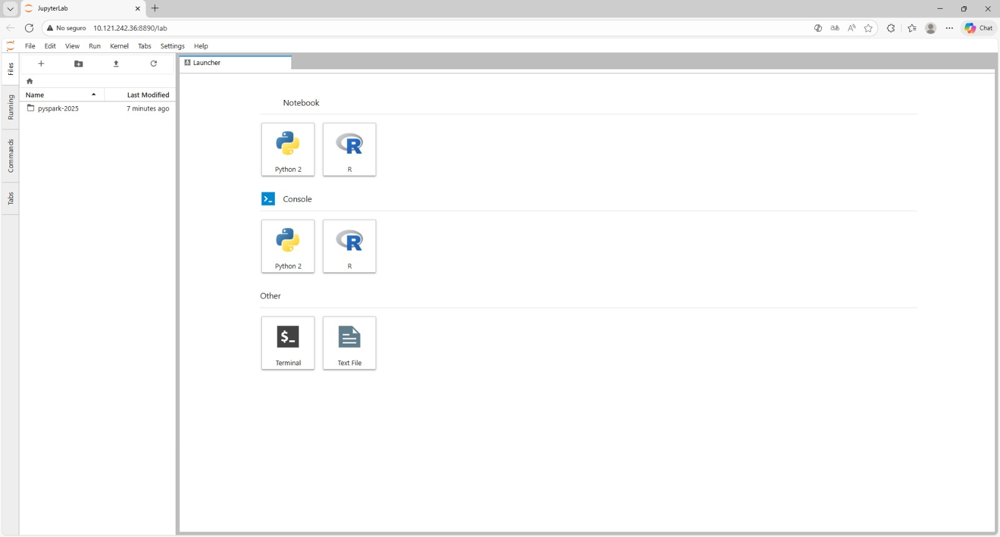
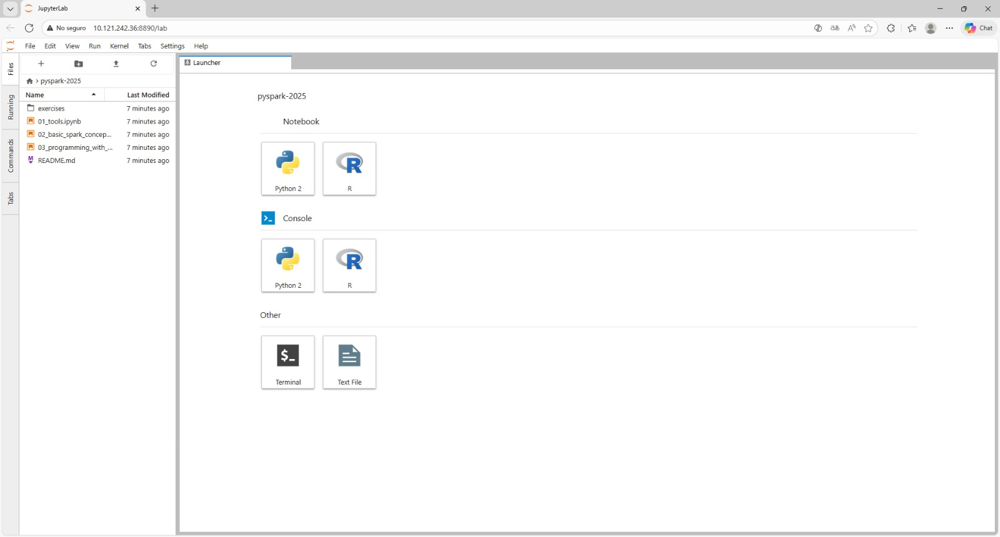

# conexion_pyspark
Apuntes conexion Pyspark Mou
## Clonar pyspark-2025 en el Gateway del CESGA

Conectarse al Gateway de Hadoop del CESGA (Terminal SSH)
```
ssh hadoop
```

En el home de Hadoop cesga:
```
mkdir notebook
cd notebook
git clone https://github.com/bigdatawirtz/pyspark-2025.git
cd pyspark-2025
ls
```
Verificar que esté esto: ```01_tools.ipynb```  ```02_basic_spark_concepts.ipynb```  ```03_programming_with_RDDs.ipynb```  ```README.md```  ```exercises```
<br>
Inicializar Jupyter Lab
```
cd
start_jupyter-lab
```
(**Ctrl + click** en el link del token para abrir Jupyter Lab en el navegador.)




En la web del Lab, Hacer doble click sobre **pyspark-2025** (panel izquierdo).



Se abren los archivos y aparecen 4 tabs. Fijarse en:
- **Files**: los archivos que hemos subido
- **Running**: muestra los archivos abiertos (límite de 2 archivos abiertos en Jupyter por usuario)

## Subir datasets a Hadoop (HDFS)
Volvemos al Gateway de Hadoop del CESGA (Terminal SSH)

```
cd /opt/cesga/cursos/pyspark_2025
cd /opt/cesga/cursos/pyspark_2025/datasets
hdfs dfs -put /opt/cesga/cursos/pyspark_2025/datasets/
hdfs dfs -ls datasets
```

Para ver info de nuestra sesión:
```
yarn top -users xueduaxx
```
(sustituir ```xueduaxx``` por nuestro nombre de usuario)

# Añadir celdas de Jupyter
1. Clic en una celda
2. Pulsar ```Esc``` para salir (sigue seleccionada)
3. Subir/Bajar con teclas de cursor arriba/abajo ↑ ↓
4. Para insertar celda nueva
   - Encima: Pulsar ```a``` (**a**bove)
   - Debajo: Pulsar ```b``` (**b**elow)

